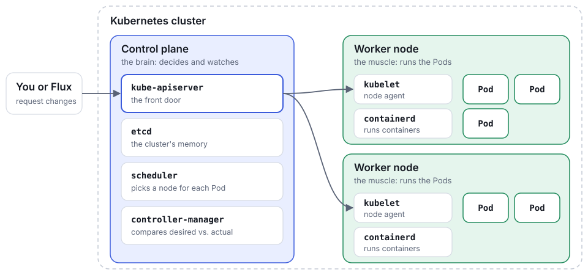
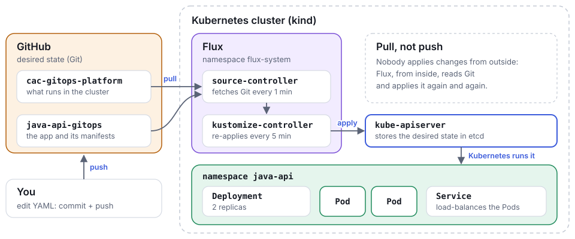

# Training 01 — GitOps and Flux foundations

<!--
Content of this training's website. Conventions (see site/README.md):
- Each "## Title {label}" is a section (one screen in presentation mode).
- A section containing the "instructor" comment is only shown in instructor mode.
- "> [!NOTES]" are instructor notes; "> [!NOTE]", "> [!TIP]", "> [!WARNING]" are callouts.
- "> [!DOCS]" with a list of links: further reading, at the foot of the section.
- ```flow, ```cards and ```steps blocks: one item per line, "Title | text".
- "repo:path" links point to the file on GitHub, on the published branch.
-->

Session outcome: tell **desired state** apart from **runtime state**, and watch [Flux](https://fluxcd.io/flux/) reconcile a real cluster from a commit.

## Before the session {Preparation}

<!-- instructor -->

Use the same branch, `training/01-gitops-flux-foundations`, in `cac-gitops-platform` and `java-api-gitops`. The platform [`GitRepository`](https://fluxcd.io/flux/components/source/gitrepositories/) must point at the Java repository **and at that branch**. Bootstrap Flux against the platform branch, never against this teaching repository.

Prepare the local image before sharing your screen:

```bash
cd ~/Workspace/java-api-gitops
docker build -t gitops-lab/java-api:0.1.0 .
kind load docker-image gitops-lab/java-api:0.1.0 --name gitops-lab
```

Verify everything before learners arrive:

```bash
kubectl config current-context
flux get sources git -A
flux get kustomizations -A
kubectl get all -n java-api
```

> [!TIP]
> Keep a second terminal open with `kubectl port-forward -n java-api svc/java-api 8080:80`; you will use it during the demo.

> [!DOCS]
> - [Instructor runbook](repo:training/01-gitops-flux-foundations/instructor-runbook.md)
> - [WSL2/Ubuntu setup](repo:docs/en/01-wsl-ubuntu-setup.md)
> - [Kind cluster tour](repo:docs/en/reference/kind-cluster-tour.md)
> - [Flux bootstrap for GitHub](https://fluxcd.io/flux/installation/bootstrap/github/)

## What is a Kubernetes cluster? {Theory · 0–5 min}

A **cluster** is a group of machines, called **nodes**, that work as if they were one. [Kubernetes](https://kubernetes.io/docs/concepts/overview/) is the software that coordinates them: you tell it *what* you want to run, and it decides *where* and keeps it running.



> [!NOTES]
> Analogy: the control plane is an airport's control tower and the nodes are the runways; nothing lands without going through the tower (`kube-apiserver`). Don't go into every component: it's enough to know they exist and what role they play. Point at the "You or Flux" box: later on they'll see that, with GitOps, whoever talks to the cluster is Flux.

> [!DOCS]
> - [Kubernetes: cluster components](https://kubernetes.io/docs/concepts/overview/components/)
> - [Kubernetes: Pods](https://kubernetes.io/docs/concepts/workloads/pods/)
> - [Kind cluster tour](repo:docs/en/reference/kind-cluster-tour.md)
> - [Kind](https://kind.sigs.k8s.io/)

## Kubernetes doesn't run commands: it reconciles state {Theory · 0–5 min}

This idea sets up everything else: GitOps uses **the same pattern**, just with Git as a stable input.

```flow
YAML / spec | You declare what you want, not how.
API Server | Stores that desired state.
Controller | Watches the difference and acts.
Status | Reports the observed real state.
```

The controller repeats this loop forever: compare `spec` with `status`, and act when they differ.

> [!NOTES]
> Ask the group: "if I delete a Pod from a 2-replica Deployment, what happens?". The answer (another one appears) is reconciliation in miniature.

> [!DOCS]
> - [Kubernetes concepts](repo:docs/en/reference/kubernetes-concepts.md)
> - [Kubernetes: controllers](https://kubernetes.io/docs/concepts/architecture/controller/)
> - [Kubernetes: objects](https://kubernetes.io/docs/concepts/overview/working-with-objects/)

## The basic objects of any application {Theory · 5–12 min}

Whether it's a Java API, a Python service or a frontend, Kubernetes describes almost any application with the same objects. What changes is the container image; what surrounds it doesn't.

```cards
[Namespace](https://kubernetes.io/docs/concepts/overview/working-with-objects/namespaces/) | A named space inside the cluster that groups and isolates the resources of an application or a team.
[Deployment](https://kubernetes.io/docs/concepts/workloads/controllers/deployment/) | Which image to run and how many copies (replicas), and how to update them without downtime.
[Service](https://kubernetes.io/docs/concepts/services-networking/service/) | A stable address that spreads traffic across the Pods, even as they are created and destroyed.
[ConfigMap](https://kubernetes.io/docs/concepts/configuration/configmap/) | Configuration kept outside the image (URLs, options…), as environment variables or files. Sensitive data goes in a [Secret](https://kubernetes.io/docs/concepts/configuration/secret/).
```

> [!NOTES]
> Ask which technologies their teams use: they all fit this pattern. Our Java API's concrete objects come later, in "Three repositories".

> [!DOCS]
> - [Kubernetes concepts](repo:docs/en/reference/kubernetes-concepts.md)
> - [Kubernetes: Secrets](https://kubernetes.io/docs/concepts/configuration/secret/)

## Anatomy of a manifest {Theory · 5–12 min}

Every object tells the same story: who I am, what I want, what is happening.

```yaml
apiVersion: apps/v1
kind: Deployment
metadata:
  name: my-app
  labels:
    app.kubernetes.io/name: my-app
spec:
  replicas: 2            # what Git edits
status:
  availableReplicas: 2   # what the cluster reports
```

```cards
apiVersion + kind | The kind of contract with Kubernetes.
metadata | Name, labels, namespace.
spec | State **desired** by the team — what Git edits.
status | State **observed** by the cluster — what `kubectl` reports.
```

> [!NOTES]
> Demo rule: don't read the whole YAML; point only at the field that changes a decision (`replicas`).

> [!DOCS]
> - [Kubernetes: `spec` and `status`](https://kubernetes.io/docs/concepts/overview/working-with-objects/#object-spec-and-status)
> - [Labels and selectors](https://kubernetes.io/docs/concepts/overview/working-with-objects/labels/)
> - [Kubernetes concepts](repo:docs/en/reference/kubernetes-concepts.md)

## GitOps: Git as the operating contract {Theory · 5–12 min}

Git stops being just history and becomes the input the cluster obeys.

```flow
Pull Request | reviewed change
Git | desired state
Flux | reconciler
Kubernetes | actual runtime
```

The four [OpenGitOps](https://opengitops.dev/) principles:

```cards
Declarative | The system is described as desired state, not as steps.
Versioned and immutable | That state lives in Git, with full history.
Pulled automatically | An agent inside the cluster pulls it; nobody pushes to the cluster.
Continuously reconciled | The agent compares and corrects drift every interval.
```

> [!DOCS]
> - [OpenGitOps principles](https://opengitops.dev/)
> - [Flux: core concepts](https://fluxcd.io/flux/concepts/)

## Three repositories, three responsibilities {Our scenario · 12–18 min}

From theory to our scenario. Changes to a cluster must be **repeatable and auditable**; that is why we separate who explains, who decides what runs in the cluster, and who describes the application.

```steps
gitops-training-lab | Teaching guide: explanations, runbooks, exercises and validation. **Not** the cluster's source of truth.
cac-gitops-platform | Flux bootstrap, namespaces, and which applications the cluster watches.
java-api-gitops | Spring Boot source, `Dockerfile`, and the API's Kubernetes manifests.
```

The manifests in `java-api-gitops/k8s/` are exactly the objects from the theory: the `api-java-gitops` Deployment, the `java-api` Service and the `java-api-config` ConfigMap, inside the `java-api` namespace that the platform creates.

> [!NOTES]
> Idea to land: the platform repo is the cluster's source of truth; this repo only teaches. Editing a copy of a manifest here changes nothing in the cluster.

> [!DOCS]
> - [Learning path](repo:docs/en/00-learning-path.md)
> - [`cac-gitops-platform`, file by file](repo:references/en/cac-gitops-platform.md)
> - [`java-api-gitops`, file by file](repo:references/en/java-api-gitops.md)

## How it all fits together: Git, Flux and Kubernetes {Our scenario · 12–18 min}

[Flux](https://fluxcd.io/flux/) is a set of controllers that live **inside** the cluster. They watch your Git repositories and apply what they find to Kubernetes, again and again. You only change Git.



> [!NOTES]
> Walk through the drawing following a single change, `replicas: 2 → 1`: you edit it and push (bottom left), `source-controller` fetches it, `kustomize-controller` applies it, and Kubernetes keeps a single Pod. It's exactly what you'll do live in Demo 1.

> [!DOCS]
> - [Flux: components](https://fluxcd.io/flux/components/)
> - [Flux architecture](repo:docs/en/reference/flux-architecture.md)
> - [Post-bootstrap tour](repo:docs/en/reference/post-bootstrap-tour.md)

## Flux in this lab {Our scenario · 12–18 min}

Flux is best understood as small, specialised controllers. Two of them do all of today's work:

```steps
source-controller | Reads the `java-api` [`GitRepository`](https://fluxcd.io/flux/components/source/gitrepositories/) every **1 min** and fetches `java-api-gitops`.
kustomize-controller | Applies `./k8s` through the `java-api` [`Kustomization`](https://fluxcd.io/flux/components/kustomize/kustomizations/) every **5 min**, with `prune`, `wait` and `timeout: 2m`.
```

```yaml
# cac-gitops-platform/clusters/kind-dev/apps/java-api.yaml
apiVersion: kustomize.toolkit.fluxcd.io/v1
kind: Kustomization
metadata:
  name: java-api
  namespace: flux-system
spec:
  interval: 5m
  path: ./k8s
  prune: true
  wait: true
  timeout: 2m
  sourceRef:
    kind: GitRepository
    name: java-api
  targetNamespace: java-api
```

> [!NOTE]
> `helm-controller` and `notification-controller` are installed too, but idle. Only the image automation controllers arrive in later trainings.

> [!DOCS]
> - [Flux architecture](repo:docs/en/reference/flux-architecture.md)
> - [Post-bootstrap tour](repo:docs/en/reference/post-bootstrap-tour.md)
> - [`GitRepository`](https://fluxcd.io/flux/components/source/gitrepositories/)
> - [`Kustomization`](https://fluxcd.io/flux/components/kustomize/kustomizations/)

## Demo 1 — A commit becomes cluster state {Live demo · 18–27 min}

```steps
Edit | In `java-api-gitops/k8s/deployment.yaml`, change `replicas: 2` → `1`.
Commit + push | To the `training/01-gitops-flux-foundations` branch.
Reconcile | Ask Flux to re-read Git and apply now, without waiting for the interval.
Verify | The Deployment goes to `1/1`.
```

```bash
git add k8s/deployment.yaml
git commit -m "scale java-api to 1 replica"
git push

flux reconcile source git java-api -n flux-system
flux reconcile kustomization java-api -n flux-system --with-source
kubectl rollout status deployment/api-java-gitops -n java-api
```

> [!NOTES]
> Stress that the `push` alone changes nothing yet: Flux doesn't react to GitHub in real time, only on its next reconciliation. `flux reconcile` just brings that moment forward.

> [!DOCS]
> - [`flux reconcile`](https://fluxcd.io/flux/cmd/flux_reconcile/)
> - [`kubectl rollout`](https://kubernetes.io/docs/reference/kubectl/generated/kubectl_rollout/)
> - [Learner guide](repo:training/01-gitops-flux-foundations/learner-guide.md)

## Demo 2 — Cause drift and watch it self-correct {Live demo · 27–34 min}

A manual change in the cluster **is not** desired state.

```bash
kubectl scale deployment/api-java-gitops -n java-api --replicas=3
kubectl get deployment/api-java-gitops -n java-api   # 3/3, briefly

flux reconcile kustomization java-api -n flux-system --with-source
kubectl get deployment/api-java-gitops -n java-api   # back to 1/1
```

Kubernetes obeys the `scale` instantly because it doesn't know Git says `1`. On the next reconciliation, Flux compares Git with the cluster and undoes the manual change.

> [!TIP]
> It isn't magic: it is `kubectl apply` re-applied to an object that drifted from its YAML.

> [!DOCS]
> - [Why drift correction works](repo:docs/en/reference/flux-architecture.md#why-drift-correction-works)
> - [`kubectl scale`](https://kubernetes.io/docs/reference/kubectl/generated/kubectl_scale/)

## Rollback through Git, and what to avoid {Wrap-up · 34–40 min}

```bash
git revert HEAD --no-edit
git push
flux reconcile kustomization java-api -n flux-system --with-source
```

Flux reconciles the reverted state like any other commit, and the history of what happened stays intact.

> [!WARNING]
> Avoid `kubectl rollout undo`: it changes the cluster without changing Git, and Flux undoes it on the next cycle. Also avoid a manual `kubectl apply` against `java-api`: Flux already manages it, and doing it by hand blurs the source of truth.

> [!NOTES]
> Don't use a ConfigMap change as a visible demo: the app consumes it as an environment variable, so an existing Pod does not restart by itself when the ConfigMap changes.

> [!DOCS]
> - [`git revert`](https://git-scm.com/docs/git-revert)
> - [Flux: `prune`](https://fluxcd.io/flux/components/kustomize/kustomizations/#prune)

## If something fails {Troubleshooting}

Inspect state before guessing, always in this order: source → Kustomization → objects → events.

```bash
flux get sources git -A
flux get kustomizations -A
kubectl get events -n java-api --sort-by=.lastTimestamp
kubectl describe deployment/api-java-gitops -n java-api
```

The [kubectl cheatsheet](repo:docs/en/reference/kubectl-cheatsheet.md) has the full troubleshooting recipe.

> [!DOCS]
> - [Troubleshooting recipe](repo:docs/en/reference/kubectl-cheatsheet.md#troubleshooting-recipe)
> - [Flux: troubleshooting](https://fluxcd.io/flux/cheatsheets/troubleshooting/)
> - [Kubernetes: debug applications](https://kubernetes.io/docs/tasks/debug/debug-application/)

## Practise on your own {Learners}

Repeat the whole exercise on **your own forks** with the [learner guide](repo:training/01-gitops-flux-foundations/learner-guide.md): forking the repositories, initial setup, Flux bootstrap, exercises and rollback.

```cards
Fork | [`cac-gitops-platform`](https://github.com/toniferr/cac-gitops-platform) and [`java-api-gitops`](https://github.com/toniferr/java-api-gitops) into your account.
Branch | `training/01-gitops-flux-foundations` in both forks.
Environment | [WSL2/Ubuntu setup](repo:docs/en/01-wsl-ubuntu-setup.md) and a `kind` cluster.
```

> [!DOCS]
> - [Kind: quick start](https://kind.sigs.k8s.io/docs/user/quick-start/)
> - [Post-bootstrap tour](repo:docs/en/reference/post-bootstrap-tour.md)

## What's next {After today}

```cards
02 · Kubernetes for GitOps | Which Kubernetes objects does GitOps actually manage?
03 · Kustomize and environments | How does an application vary per environment (dev/qa/prod) safely?
04 · Application delivery | How does a built image reach the cluster through Git?
```

Study references, to read whenever you like:

- [Kind cluster tour](repo:docs/en/reference/kind-cluster-tour.md)
- [Post-bootstrap tour](repo:docs/en/reference/post-bootstrap-tour.md)
- [Kubernetes concepts](repo:docs/en/reference/kubernetes-concepts.md)
- [Flux architecture](repo:docs/en/reference/flux-architecture.md)
- [kubectl cheatsheet](repo:docs/en/reference/kubectl-cheatsheet.md)
- [Full learning path](repo:docs/en/00-learning-path.md)
