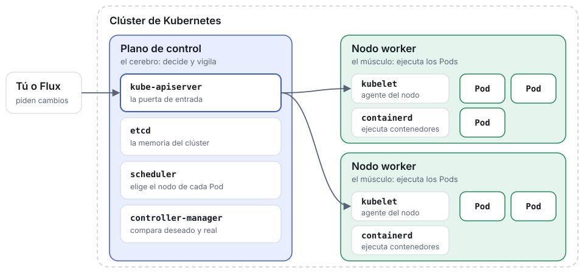
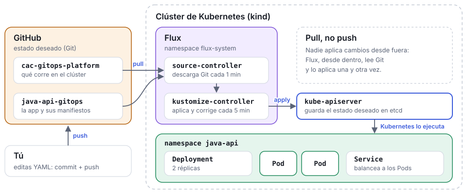

# Formación 01 — Fundamentos de GitOps y Flux

<!--
Contenido de la web de esta formación. Convenciones (ver site/README.md):
- Cada "## Título {etiqueta}" es una sección (una pantalla en modo presentación).
- Una sección con el comentario "instructor" solo se ve en modo formador.
- "> [!NOTES]" son notas del formador; "> [!NOTE]", "> [!TIP]", "> [!WARNING]" son avisos.
- "> [!DOCS]" con una lista de enlaces: documentación para ampliar, al pie de la sección.
- Bloques ```flow, ```cards y ```steps: una línea por elemento, "Título | texto".
- Enlaces "repo:ruta" apuntan al fichero en GitHub, en la rama publicada.
-->

Resultado de la sesión: distinguir **estado deseado** de **estado de ejecución**, y ver a [Flux](https://fluxcd.io/flux/) reconciliar un clúster real a partir de un commit.

## Antes de la sesión {Preparación}

<!-- instructor -->

Usa la misma rama, `training/01-gitops-flux-foundations`, en `cac-gitops-platform` y `java-api-gitops`. El [`GitRepository`](https://fluxcd.io/flux/components/source/gitrepositories/) de plataforma debe apuntar al repositorio Java **y a esa rama**. Haz bootstrap de Flux contra la rama de plataforma.

Prepara la imagen local antes de compartir pantalla:

```bash
cd ~/Workspace/java-api-gitops
docker build -t gitops-lab/java-api:0.1.0 .
kind load docker-image gitops-lab/java-api:0.1.0 --name gitops-lab
```

Verifica todo antes de que llegue el alumnado:

```bash
kubectl config current-context
flux get sources git -A
flux get kustomizations -A
kubectl get all -n java-api
```

> [!TIP]
> Deja abierta una segunda terminal con `kubectl port-forward -n java-api svc/java-api 8080:80`; la usarás en la demo.

> [!DOCS]
> - [Guion del formador](repo:training/01-gitops-flux-foundations/instructor-runbook.es.md)
> - [Preparación de WSL2/Ubuntu](repo:docs/es/01-preparacion-wsl-ubuntu.md)
> - [Recorrido por el clúster Kind](repo:docs/es/reference/recorrido-cluster-kind.md)
> - [Bootstrap de Flux con GitHub](https://fluxcd.io/flux/installation/bootstrap/github/)

## ¿Qué es un clúster de Kubernetes? {Teoría · 0–5 min}

Un **clúster** es un grupo de máquinas, llamadas **nodos**, que trabajan como si fueran una sola. [Kubernetes](https://kubernetes.io/docs/concepts/overview/) es el software que las coordina: tú le dices *qué* quieres ejecutar, y él decide *dónde* y se encarga de que siga funcionando.



> [!NOTES]
> Analogía: el plano de control es la torre de control de un aeropuerto y los nodos son las pistas; nada aterriza sin pasar por la torre (`kube-apiserver`). No entres en cada componente: basta con saber que existen y qué papel juegan. Señala la caja «Tú o Flux»: más adelante verán que, con GitOps, quien habla con el clúster es Flux.

> [!DOCS]
> - [Kubernetes: componentes del clúster](https://kubernetes.io/docs/concepts/overview/components/)
> - [Kubernetes: Pods](https://kubernetes.io/docs/concepts/workloads/pods/)
> - [Recorrido por el clúster Kind](repo:docs/es/reference/recorrido-cluster-kind.md)
> - [Kind](https://kind.sigs.k8s.io/)

## Kubernetes no ejecuta órdenes: reconcilia estado {Teoría · 0–5 min}

Esta idea prepara todo lo demás: GitOps usa **el mismo patrón**, solo que con Git como entrada estable.

```flow
YAML / spec | Declaras qué quieres, no cómo hacerlo.
`kube-apiserver` | Lo valida y lo guarda en `etcd` como estado deseado.
`controller-manager` | Sus controladores comparan deseado y real, y actúan.
Status | Reporta el estado real observado.
```

El controlador repite este ciclo sin fin: comparar `spec` con `status`, y actuar si difieren.

> [!NOTES]
> Pregunta al grupo: «si borro un Pod de un Deployment con 2 réplicas, ¿qué pasa?». La respuesta (aparece otro) es la reconciliación en pequeño.

> [!DOCS]
> - [Conceptos de Kubernetes](repo:docs/es/reference/conceptos-kubernetes.md)
> - [Kubernetes: controladores](https://kubernetes.io/docs/concepts/architecture/controller/)
> - [Kubernetes: objetos](https://kubernetes.io/docs/concepts/overview/working-with-objects/)

## Los objetos básicos de cualquier aplicación {Teoría · 5–12 min}

Da igual que sea una API en Java, un servicio en Python o un frontend: Kubernetes describe casi cualquier aplicación con los mismos objetos. Lo que cambia es la imagen del contenedor; lo que la rodea, no.

```cards
[Namespace](https://kubernetes.io/docs/concepts/overview/working-with-objects/namespaces/) | Un espacio con nombre dentro del clúster que agrupa y aísla los recursos de una aplicación o de un equipo.
[Deployment](https://kubernetes.io/docs/concepts/workloads/controllers/deployment/) | Qué imagen ejecutar y cuántas copias (réplicas), y cómo actualizarlas sin cortar el servicio.
[Service](https://kubernetes.io/docs/concepts/services-networking/service/) | Una dirección estable que reparte el tráfico entre los Pods, aunque estos se creen y se destruyan.
[ConfigMap](https://kubernetes.io/docs/concepts/configuration/configmap/) | La configuración fuera de la imagen (URLs, opciones…), como variables de entorno o ficheros. Los datos sensibles van en un [Secret](https://kubernetes.io/docs/concepts/configuration/secret/).
```

> [!NOTES]
> Pregunta qué tecnologías usan en sus equipos: todas encajan en este patrón. Los objetos concretos de nuestra API Java aparecen más adelante, en «Dos repositorios».

> [!DOCS]
> - [Conceptos de Kubernetes](repo:docs/es/reference/conceptos-kubernetes.md)
> - [Kubernetes: Secrets](https://kubernetes.io/docs/concepts/configuration/secret/)

## Anatomía de un manifiesto {Teoría · 5–12 min}

Todo objeto cuenta la misma historia: quién soy, qué quiero, qué está ocurriendo.

```yaml
apiVersion: apps/v1
kind: Deployment
metadata:
  name: mi-app
  labels:
    app.kubernetes.io/name: mi-app
spec:
  replicas: 2            # lo que edita Git
status:
  availableReplicas: 2   # lo que reporta el clúster
```

```cards
apiVersion + kind | Tipo de contrato con Kubernetes.
metadata | Nombre, labels, namespace.
spec | Estado **deseado** por el equipo — lo que edita Git.
status | Estado **observado** por el clúster — lo que reporta `kubectl`.
```

> [!NOTES]
> Regla de la demo: no leas todo el YAML; señala solo el campo que cambia de decisión (`replicas`).

> [!DOCS]
> - [Kubernetes: `spec` y `status`](https://kubernetes.io/docs/concepts/overview/working-with-objects/#object-spec-and-status)
> - [Labels y selectores](https://kubernetes.io/docs/concepts/overview/working-with-objects/labels/)
> - [Conceptos de Kubernetes](repo:docs/es/reference/conceptos-kubernetes.md)

## GitOps: Git como contrato operativo {Teoría · 5–12 min}

Git deja de ser solo historial y pasa a ser la entrada que el clúster obedece.

```flow
Pull Request | cambio revisado
Git | estado deseado
Flux | reconciliador
Kubernetes | ejecución real
```

Los cuatro principios de [OpenGitOps](https://opengitops.dev/):

```cards
Declarativo | El sistema se describe como estado deseado, no como pasos.
Versionado e inmutable | Ese estado vive en Git, con historial completo.
Pull automático | Un agente dentro del clúster lo trae; nadie hace push al clúster.
Reconciliación continua | El agente compara y corrige el drift en cada intervalo.
```

> [!DOCS]
> - [Principios de OpenGitOps](https://opengitops.dev/)
> - [Flux: conceptos básicos](https://fluxcd.io/flux/concepts/)

## Dos repositorios, dos responsabilidades {Nuestro escenario · 12–18 min}

Pasamos de la teoría a nuestro escenario. Los cambios en un clúster deben ser **repetibles y auditables**; por eso separamos quién decide qué corre en el clúster y quién describe la aplicación.

```steps
cac-gitops-platform | Bootstrap de Flux, namespaces y qué aplicaciones observa el clúster.
java-api-gitops | Código Spring Boot, `Dockerfile` y los manifiestos Kubernetes de la API.
```

Los manifiestos de `java-api-gitops/k8s/` son justo los objetos de la teoría: el Deployment `api-java-gitops`, el Service `java-api` y el ConfigMap `java-api-config`, dentro del namespace `java-api` que crea la plataforma.

> [!NOTES]
> Idea a fijar: `cac-gitops-platform` es la fuente de verdad del clúster (qué corre en él); `java-api-gitops` describe la aplicación. Cada equipo cambia su repositorio sin tocar el del otro.

> [!DOCS]
> - [Ruta de aprendizaje](repo:docs/es/00-ruta-aprendizaje.md)
> - [`cac-gitops-platform`, fichero a fichero](repo:references/es/cac-gitops-platform.md)
> - [`java-api-gitops`, fichero a fichero](repo:references/es/java-api-gitops.md)

## Cómo encaja todo: Git, Flux y Kubernetes {Nuestro escenario · 12–18 min}

[Flux](https://fluxcd.io/flux/) es un conjunto de controladores que viven **dentro** del clúster. Vigilan tus repositorios de Git y aplican en Kubernetes lo que encuentran, una y otra vez. Tú solo cambias Git.



> [!NOTES]
> Recorre el dibujo siguiendo un único cambio, `replicas: 2 → 1`: lo editas y haces push (abajo a la izquierda), `source-controller` lo descarga, `kustomize-controller` lo aplica y Kubernetes deja un solo Pod. Es exactamente lo que harás en vivo en la Demo 1.

> [!DOCS]
> - [Flux: componentes](https://fluxcd.io/flux/components/)
> - [Arquitectura de Flux](repo:docs/es/reference/arquitectura-flux.md)
> - [Recorrido post-bootstrap](repo:docs/es/reference/recorrido-post-bootstrap.md)

## Flux en este laboratorio {Nuestro escenario · 12–18 min}

Flux se entiende mejor como controladores pequeños y especializados. Dos hacen todo el trabajo hoy:

```steps
source-controller | Lee el [`GitRepository`](https://fluxcd.io/flux/components/source/gitrepositories/) `java-api` cada **1 min** y descarga `java-api-gitops`.
kustomize-controller | Aplica `./k8s` mediante la [`Kustomization`](https://fluxcd.io/flux/components/kustomize/kustomizations/) `java-api` cada **5 min**, con `prune`, `wait` y `timeout: 2m`.
```

```yaml
# cac-gitops-platform/clusters/kind-dev/apps/java-api.yaml
apiVersion: kustomize.toolkit.fluxcd.io/v1
kind: Kustomization
metadata:
  name: java-api
  namespace: flux-system
spec:
  interval: 5m
  path: ./k8s
  prune: true
  wait: true
  timeout: 2m
  sourceRef:
    kind: GitRepository
    name: java-api
  targetNamespace: java-api
```

> [!NOTE]
> `helm-controller` y `notification-controller` también están instalados, pero inactivos. Solo los controladores de automatización de imágenes llegarán en formaciones posteriores.

> [!DOCS]
> - [Arquitectura de Flux](repo:docs/es/reference/arquitectura-flux.md)
> - [Recorrido post-bootstrap](repo:docs/es/reference/recorrido-post-bootstrap.md)
> - [`GitRepository`](https://fluxcd.io/flux/components/source/gitrepositories/)
> - [`Kustomization`](https://fluxcd.io/flux/components/kustomize/kustomizations/)

## Demo 1 — Un commit se convierte en estado del clúster {Demo en vivo · 18–27 min}

```steps
Editar | En `java-api-gitops/k8s/deployment.yaml`, cambia `replicas: 2` → `1`.
Commit + push | A la rama `training/01-gitops-flux-foundations`.
Reconciliar | Pide a Flux que relea Git y aplique ya, sin esperar al intervalo.
Verificar | El Deployment pasa a `1/1`.
```

```bash
git add k8s/deployment.yaml
git commit -m "scale java-api to 1 replica"
git push

flux reconcile source git java-api -n flux-system
flux reconcile kustomization java-api -n flux-system --with-source
kubectl rollout status deployment/api-java-gitops -n java-api
```

> [!NOTES]
> Remarca que el `push` por sí solo no cambia nada todavía: Flux no reacciona a GitHub en tiempo real, solo en su próxima reconciliación. `flux reconcile` solo adelanta ese momento.

> [!DOCS]
> - [`flux reconcile`](https://fluxcd.io/flux/cmd/flux_reconcile/)
> - [`kubectl rollout`](https://kubernetes.io/docs/reference/kubectl/generated/kubectl_rollout/)
> - [Guía del alumno](repo:training/01-gitops-flux-foundations/learner-guide.es.md)

## Demo 2 — Provocar drift y verlo corregirse {Demo en vivo · 27–34 min}

Un cambio manual en el clúster **no es** estado deseado.

```bash
kubectl scale deployment/api-java-gitops -n java-api --replicas=3
kubectl get deployment/api-java-gitops -n java-api   # 3/3, momentáneamente

flux reconcile kustomization java-api -n flux-system --with-source
kubectl get deployment/api-java-gitops -n java-api   # vuelve a 1/1
```

Kubernetes obedece el `scale` al instante porque no sabe que Git dice `1`. En la siguiente reconciliación, Flux compara Git con el clúster y deshace el cambio manual.

> [!TIP]
> No es magia: es `kubectl apply` reaplicado sobre un objeto que se desvió de su YAML.

> [!DOCS]
> - [Por qué funciona la corrección de drift](repo:docs/es/reference/arquitectura-flux.md#por-qué-funciona-la-corrección-de-drift)
> - [`kubectl scale`](https://kubernetes.io/docs/reference/kubectl/generated/kubectl_scale/)

## Rollback por Git, y qué evitar {Cierre · 34–40 min}

```bash
git revert HEAD --no-edit
git push
flux reconcile kustomization java-api -n flux-system --with-source
```

Flux reconcilia el estado revertido igual que cualquier otro commit, y el historial de lo ocurrido queda intacto.

> [!WARNING]
> Evita `kubectl rollout undo`: cambia el clúster sin cambiar Git, y Flux lo deshace en el siguiente ciclo. Evita también `kubectl apply` manual contra `java-api`: Flux ya lo gestiona y hacerlo a mano confunde el origen de verdad.

> [!NOTES]
> No uses un cambio de ConfigMap como demostración visible: la app lo consume como variable de entorno, así que un Pod existente no se reinicia solo al cambiar el ConfigMap.

> [!DOCS]
> - [`git revert`](https://git-scm.com/docs/git-revert)
> - [Flux: `prune`](https://fluxcd.io/flux/components/kustomize/kustomizations/#prune)

## Si algo falla {Troubleshooting}

Inspecciona estado antes de adivinar, siempre en este orden: fuente → Kustomization → objetos → eventos.

```bash
flux get sources git -A
flux get kustomizations -A
kubectl get events -n java-api --sort-by=.lastTimestamp
kubectl describe deployment/api-java-gitops -n java-api
```

La [chuleta de kubectl](repo:docs/es/reference/chuleta-kubectl.md) tiene la receta completa de troubleshooting.

> [!DOCS]
> - [Receta de troubleshooting](repo:docs/es/reference/chuleta-kubectl.md#receta-de-troubleshooting)
> - [Flux: troubleshooting](https://fluxcd.io/flux/cheatsheets/troubleshooting/)
> - [Kubernetes: depurar aplicaciones](https://kubernetes.io/docs/tasks/debug/debug-application/)

## Practica por tu cuenta {Alumnado}

Repite el ejercicio completo en **tus propios forks**, con la [guía del alumno](repo:training/01-gitops-flux-foundations/learner-guide.es.md): fork de los repositorios, configuración inicial, bootstrap de Flux, ejercicios y rollback.

```cards
Fork | [`cac-gitops-platform`](https://github.com/toniferr/cac-gitops-platform) y [`java-api-gitops`](https://github.com/toniferr/java-api-gitops) en tu cuenta.
Rama | `training/01-gitops-flux-foundations` en ambos forks.
Entorno | [Preparación de WSL2/Ubuntu](repo:docs/es/01-preparacion-wsl-ubuntu.md) y clúster `kind`.
```

> [!DOCS]
> - [Kind: quick start](https://kind.sigs.k8s.io/docs/user/quick-start/)
> - [Recorrido post-bootstrap](repo:docs/es/reference/recorrido-post-bootstrap.md)

## Qué sigue {Después de hoy}

```cards
02 · Kubernetes para GitOps | ¿Qué objetos de Kubernetes gestiona realmente GitOps?
03 · Kustomize y entornos | ¿Cómo varía una aplicación por entorno (dev/qa/prod) con seguridad?
04 · Entrega de aplicaciones | ¿Cómo llega una imagen construida al clúster a través de Git?
```

Referencias de estudio, para leer cuando quieras:

- [Recorrido por el clúster Kind](repo:docs/es/reference/recorrido-cluster-kind.md)
- [Recorrido post-bootstrap](repo:docs/es/reference/recorrido-post-bootstrap.md)
- [Conceptos de Kubernetes](repo:docs/es/reference/conceptos-kubernetes.md)
- [Arquitectura de Flux](repo:docs/es/reference/arquitectura-flux.md)
- [Chuleta de kubectl](repo:docs/es/reference/chuleta-kubectl.md)
- [Ruta de aprendizaje completa](repo:docs/es/00-ruta-aprendizaje.md)
